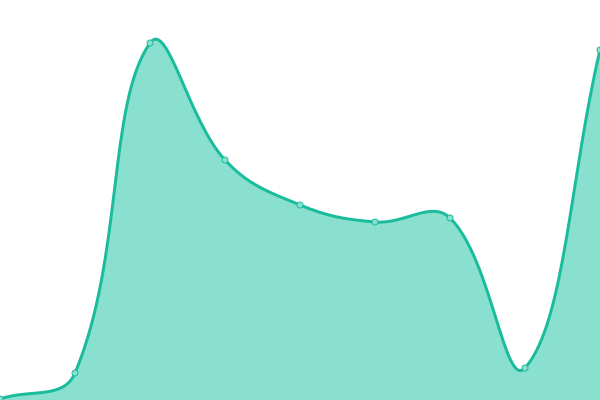
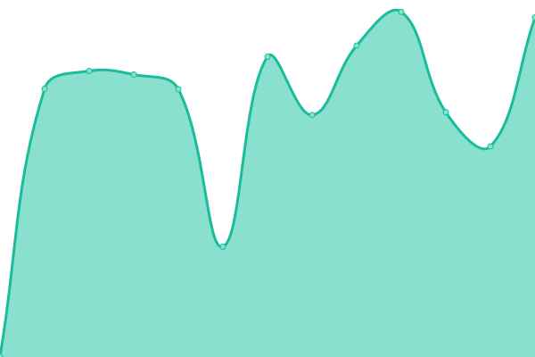
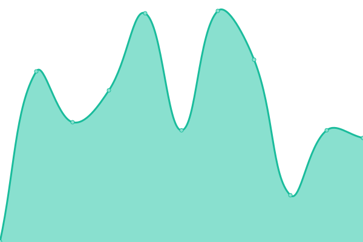

# [📈 Live Status](https://status.vukkybox.com): <!--live status--> **🟩 All systems operational**

This repository contains the open-source uptime monitor and status page for [LIT Devs (formerly Vukky Limited)](https://status.vukkybox.com), powered by [Upptime](https://github.com/upptime/upptime).

With [Upptime](https://upptime.js.org), you can get your own unlimited and free uptime monitor and status page, powered entirely by a GitHub repository. We use [Issues](https://github.com/litdevs/upptime/issues) as incident reports, [Actions](https://github.com/litdevs/upptime/actions) as uptime monitors, and [Pages](https://status.vukkybox.com) for the status page.

<!--start: status pages-->
<!-- This summary is generated by Upptime (https://github.com/upptime/upptime) -->
<!-- Do not edit this manually, your changes will be overwritten -->
<!-- prettier-ignore -->
| URL | Status | History | Response Time | Uptime |
| --- | ------ | ------- | ------------- | ------ |
|  [Vukkybox](https://vukkybox.com) | 🟩 Up | [vukkybox.yml](https://github.com/LITdevs/upptime/commits/HEAD/history/vukkybox.yml) | 

 425ms
     
 | 

<a href="https://status.litdevs.org/history/vukkybox">100.00%</a>
    

|  [litdevs.org](https://litdevs.org) | 🟩 Up | [litdevs-org.yml](https://github.com/LITdevs/upptime/commits/HEAD/history/litdevs-org.yml) | 

 292ms
     
 | 

<a href="https://status.litdevs.org/history/litdevs-org">100.00%</a>
    

|  [WikiLIT](https://wiki.litdevs.org) | 🟩 Up | [wiki-lit.yml](https://github.com/LITdevs/upptime/commits/HEAD/history/wiki-lit.yml) | 

 409ms
     
 | 

<a href="https://status.litdevs.org/history/wiki-lit">100.00%</a>
    

|  [Logo Changer](https://logo.litdevs.org) | 🟩 Up | [logo-changer.yml](https://github.com/LITdevs/upptime/commits/HEAD/history/logo-changer.yml) | 

 423ms
     
 | 

<a href="https://status.litdevs.org/history/logo-changer">100.00%</a>
    

<!--end: status pages-->

[**Visit our status website →**](https://status.vukkybox.com)

## 📄 License

- Powered by: [Upptime](https://github.com/upptime/upptime)
- Code: [MIT](./LICENSE) © [LIT Devs (formerly Vukky Limited)](https://status.vukkybox.com)
- Data in the `./history` directory: [Open Database License](https://opendatacommons.org/licenses/odbl/1-0/)
